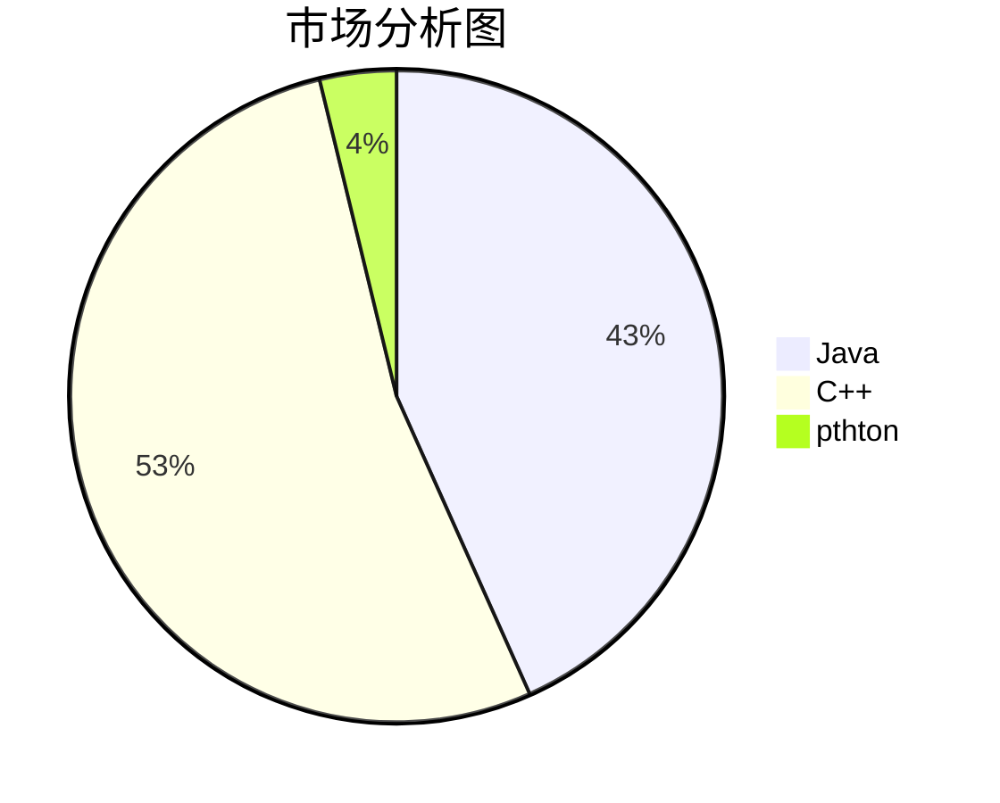
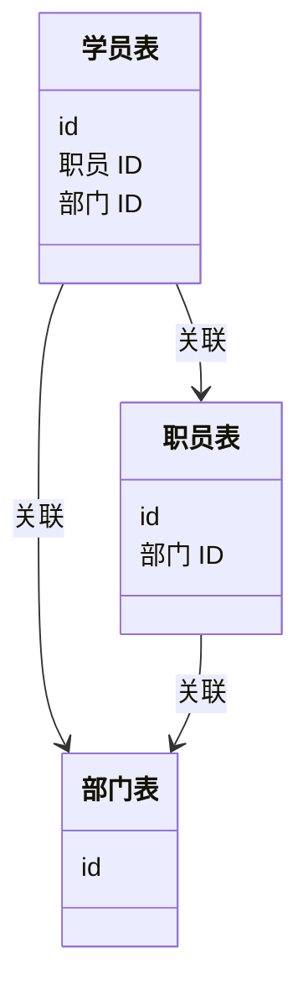
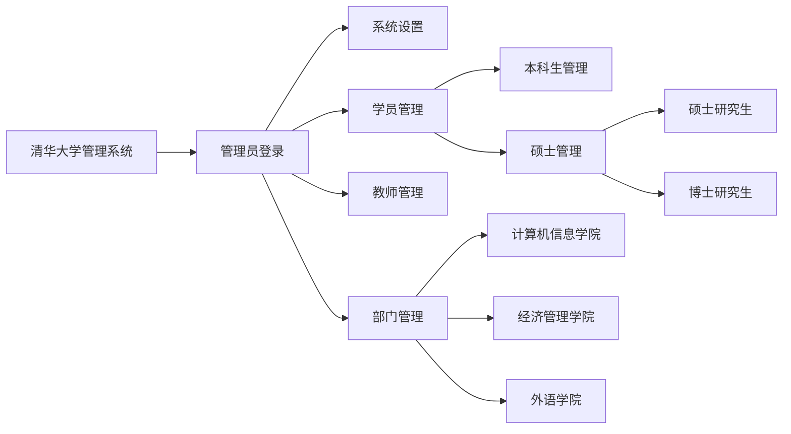

<!-- 封面 -->

# 摘要
<!-- 中文和英文摘要，包含关键字 -->

这里插入任意 的文本内容。

...

这里插入任意的文本内容。

**关键字**：编辑器，格式化，Markdown.
# 目录
<!-- 使用[TOC]生成目录 -->

# 第一章 绪论
<!-- 描述写作目的，以文字为主，引用他人数据 -->

## 1.1 课题背景

[这是一段正文内容]
>引用他人的论点论据，用来佐证本文的背景及意义。
>
>——引文出处，适当增加尾注[^1]

[这是一段正文内容]

## 1.2 信息化管理

## 1.3 系统设计目的和内容

[^1]:绪论尾注 1 的内容。
# 第二章 需求分析
<!-- 包含饼图 -->

## 2.1 可行性分析
### 2.1.1 技术可行性

同类产品技术解决方案：

- xx 公司实现的产品，用了 xx 技术；
- xx 公司实现的产品，用了 xx 技术；
- xx 公司实现的产品，用来 xx 技术。
### 2.1.2 经济可行性


<center>图1：市场分析图</center>
### 2.1.3 管理可行性

## 2.2 需求分析
### 2.2.1 功能需求

- 功能点1
  - 子功能点 1-1
  - 子功能点 1-2
  - 子功能点 1-3
- 功能点2
  - 子功能点 2-1
  - 子功能点 2-2
- 功能点3
### 2.2.2 环境需求
|需求项|需求指标|
|--------|-------|
|操作系统|CentOs 7|
|Mysql|5.7|
|Oracle|11.2.3|
|Redis|6.1|
|内存|32G|
|存储|500G|
## 2.3 数据分析
数据表整理
|数据对象|简述|来源|核心数据|主键|
|-------------|------|-------|-------|-------|
|管理员表|保存系统管理信息|注册|登录名|登录名|
|学生表|保存学生信息|批量导入|姓名、学号|学号|
|教师表|保存教师职工信息|批量导入|姓名、职工号|职工号|
|部门表|保存部门、班级信息|批量导入|名称、编号|编号|

# 第三章 概要设计
<!-- 包含流程图、类图、数据库表等 -->
## 3.1 数据表设计

**管理员表**
管理员表的描述文字。
*表1：管理员表结构*
|列名|数据类型|长度|非空|主键|
|-----|------|------|-----|------|
|id|UUID|64|√|√|
|accout|VARCHAR(32)|32|√||
|password|VARCHAR(32)|32|||

**学生信息表**

学生信息表的描述文字。

*表2：学生表结构*

|列名|数据类型|长度|非空|主键|
|----|----|-----|----|---|
|id|UUID|64|√|√|
|name|VARCHAR(32)|32|√||
|age|Integer|8|||

## 3.2 数据关系图


<center>图3-1：数据关系表</center>

## 3.3 功能结构图



# 第四章 功能实现
<!-- 穿插大亮的图片和源代码 -->

## 4.1 后台代码实现

```java
public static void mian(String[] args){
  System.out.println("Hello world!");
}
```

## 4.2 前段代码实现

前端 HTML 代码：

```html
<!DOCTYPE HTML>
<html>
  <head></head>
  <body>
   <p>Hello world!</p>
  </body>
</html>
```

前端脚本代码：

```javascript
function main(){
  alert("Hello World!");
}

 window.onload = main;

```

## 4.3 配置文件代码

```properties
jdbc.driver=com.mysql.jdbc.Driver
jdbc.url=jdbc:mysql://localhost:3306
jdbc.username=root
jdbc.password=root
```

## 4.4 运行及启动日志

```bash
java -jar ucc.jar &
----
Hello world
```

# 第五章 系统测试
<!-- 以表格为主 -->

## 5.1 功能点完成情况对照

- [x] 数据库创建
- [x] 后端开发
- [x] 前端开发
- [ ] 接口联调
- [ ] 日志归档

## 5.2 测试结果

|功能点|是否测试|是否通过|备注|
|--------|------|------|-------|
|登录| <font color="green">√</font> | <font color="green">√</font> |无|
|登出|<font color="green">√</font>|<font color="red">x</font>|无|


#  参考文献
<!-- 尾注 -->

正文某处[^1]

正文某处[^2]

正文某处[^3]

[^1]: xxx,图书管理系统设计。北京：北京大学出版社，2019。
[^2]: xxx,软件管理。北京：清华大学出版社,2020。


# 目录

[toc]