# 这是一个标题
## 这是一个标题
### 这是一个标题
#### 这是一个标题
##### 这是一个标题
###### 这个是一个标题
注：一定要注意#符号后面要有空格


### 这是标题

这是第一段正文文字的第一句。
这是第一段正文文字的第二句。这是第一段正文文字的第三局。

这是第二段正文文字的第一句。
这是第二段正文文字的第二句。

### 水调歌头·明月几时有

#### 苏轼 / 宋

　　丙辰中秋，欢饮达旦，大醉，作此篇，兼怀子由。

　　明月几时有？把酒问青天。
不知天上宫阙，今夕是何年。
我欲乘风归去，又恐琼楼玉宇，高处不胜寒。
起舞弄清影，何似在人间。

　　转朱阁，低绮户，照无眠。不应有恨，何事长向别时圆？ 
人有悲欢离合，月有阴晴圆缺，此事古难全。
但愿人长久，千里共婵娟。

注意：
	中文段落缩进需要使用中文全角空格，如果要让文字另起一行而不分段，需在行尾增加两个空格。         

### 下面是三类分割符

使用[星号]分割符
***
使用[减号]分隔符

---
使用[下划线]分隔符
___

注：
分割符建议使用下划线，如果使用减号分割符的时候一定要与前面书写内容空一行，分隔符前后不能有其他内容

# 科普也要创新

林群
2019年12月19日08:12 来源：人民网-人民日报
___

　　什么叫科普？一次我开会乘坐出租车，司机问我：“ ……
　　...
　　所以，做科普也可以创新，和做科研一样。
　　_《人民日报》(2019年12月19日 19版)_
　　

___

相关新闻：

- [全国科学传播发展指数报工出炉](http://baidu.com)

## 使用列表

使用[星号]表示无序项目

* 项目1
  * 项目1.1
  * 项目1.2
  * 项目1.3
* 项目2
* 项目3

使用[加号]表示无序项目

+ 项目1
  + 项目1.1
  + 项目1.2
  + 项目1.3
+ 项目2
+ 项目3

使用[减号]表示无序项目

- 项目1
  - 项目1.1
  - 项目1.2
  - 项目1.3
- 项目2
- 项目3

使用有序序号

1. 数据结构
   1. 浙江大学视频
   2. 清华大学视频
2. 操作系统
3. 数据库原理
4. 算法原理

___

#### 行内代码

行内的html代码： `<head><title>网页标题</title></head>`

行内的json代码： `var json = {key,value};`

这段代码里包含反引号：``select `state` from user;``

行内代码的定义是由反引号开始的。形如：`` `"hello,${}"` ``

___

#### 代码块

使用4个连续空格展示代码块

    public static void mian(String[] args){
      System.out.println("hello world!");
    }

使用三个连续的反引号展示代码块

```
public void love(){
  System.out.println("Love dear wife forever!");
}
```

使用三个连续的反引号+语言展示代码块(java,json,html,c,c++,sql,javascript)，该展示高亮定义

Java代码块
```java
public void makeMoney(){
  System.out.println("Double salary every three years");
}
```
C语言代码块
```c
#inclue <stdio.h>
int main()
{
  printf("Hello,World!");
  return 0;
}
```

___

#### 超链接

早晚要考研的名校，[清华大学](),[北京大学](),[北京航空航天大学](),[北京邮电大学](),[北京交通大学](),[北京科技大学](),[北京工业大学]()。

个人常备的网站
[百度](http://www.baidu.com)
[慕课](http://www.imooc.com)
[Github](http://www.github.com)
[学堂在线](http:/www.xuetangx.com)

声明超链接的细节

[天坛][tiantan]公园，是明清两代皇帝每年祭天和祈祷五谷丰收的地方。[天坛][tiantan]以严谨的建筑布局、奇特的建筑构造和魅丽的建筑装饰著称于世。

[tiantan]: http://www.tiantanpark.com

___

#### 学生管理系统（四）

- [x] **数据库设计**
	责任人：小丙
	任务描述：搭建MySql数据库环境；设计数据表；数据库设计满足三大范式
	预计完成时间5天
	- [x] 搭建数据库环境
	- [x] 整理数据表名、主要字段
	- [x] 设计E-R图
	- [x] 使数据库符号范式要求
	- [x] 应用到数据库中
	- [x] 整理此部分文档笔记

- [ ] **服务端开发**
	责任人：小乙
	任务描述：服务端采用Java语言；为前端提供Rest接口。
	预计完成时间15天
	- [x] 搭建服务端开发环境
	- [ ] 根据数据表结构生成Java对象
	- [x] 根据业务需求编写控制器
	- [ ] 规范数据传输方式
	- [ ] 发布到测试环境
	- [ ] 整理此部分文档笔记

___

#### 特殊符号

如果不能使用转义字符，以下算式不能按预期输出
2*3*4=24
以下算式的正确写法为：
2\*3\*4=24

判断下面的大小
100 >  87 ? "true":"false";

___

#### 代码高亮

html

```html
<!DOCTYPE html>
<html>
   <head><titel>highlight</title></head>
   <body>
     <p>Hello world</p>
   <body>
</html>
```

```java
public static void main(String[] args){
  System.out.println("Hello World!");
}
```

```python
# Python
print("Hello,World!")
```

```ruby
# Ruby
puts "Hello,World!"
```

```scala
// Scala
object HelloWorld extend App {
  println("Hello,world");
}
```

```go
// Go
package main
import "fmt"
func main(){
  fmt.Println("Hello,world!")
}
```

___

#### 表格

|编号|周一|周二|周三|周四|周五|
|----:|:----:|:----:|:----:|:----:|:----|
|**1**|java|mysql|oracle|redis|c++|
|**2**|mysql|java|c++|spring|操作系统|
||||
|**3**|数据结构|操作系统|数据库原理|计算机网络|软件工程|
|**4**|算法设计|项目管理|英语|运筹学|微积分|

___

#### 流程图

流程图分为LR(left->right),RL(right->left),TB(top->bottom),BT(bottom->top)


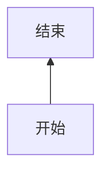

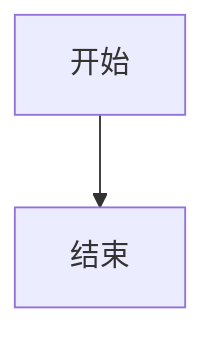

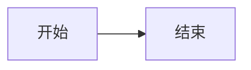

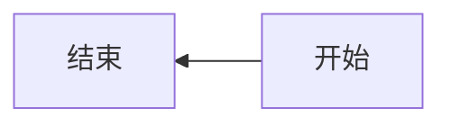

节点的形状

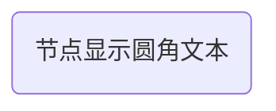
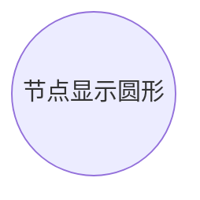
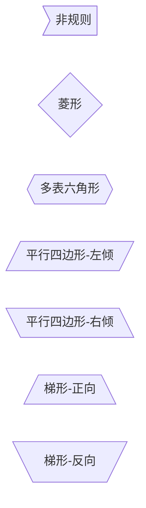

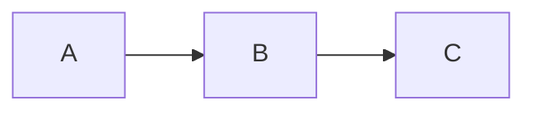
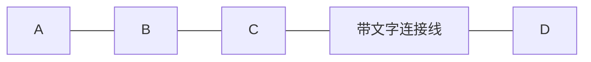
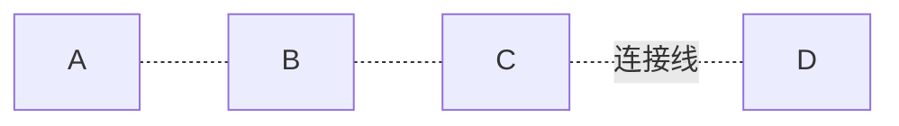
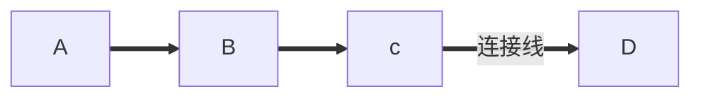

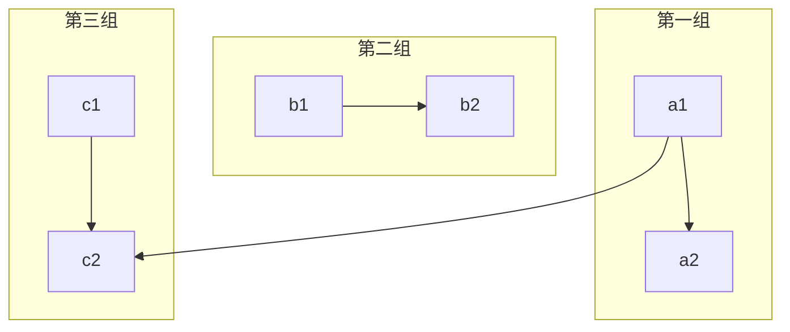

#### 类图

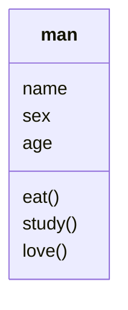

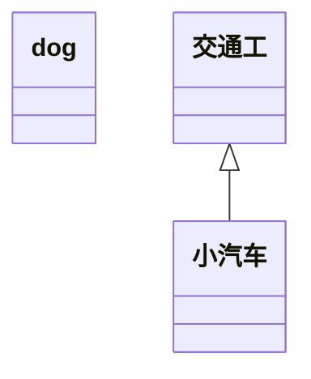

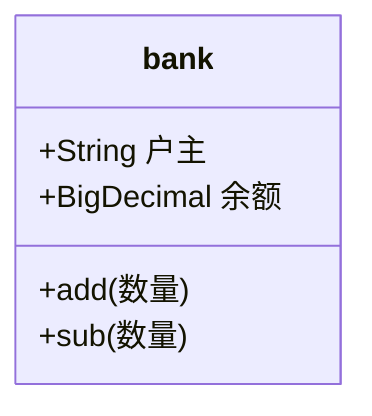

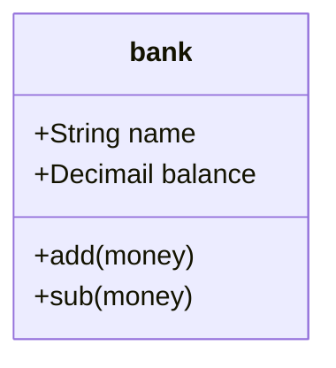

___

#### 饼图

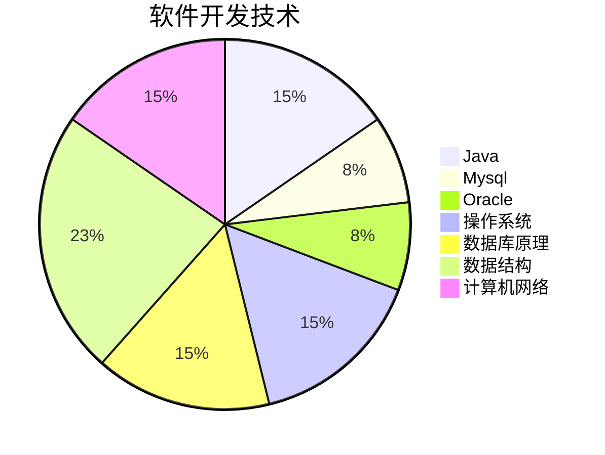
<center>图1：必备精通技能</center>

___

#### 上标、下标以及数学公式

a<sup>2</sup>+b<sup>2</sup>=c<sup>2</sup>

Mg + ZnSO<sub>4</sub> == MgSO<sub>4</sub> +Zn

上标符号：$x^{20}$
下标符号：$y_2+x^{y^2}$
组合符号：$a^{x^2+y^2}$


##### 角标

这里有一个角标[^角标1]。

[^角标1]:  此处是一个角标。


先帝[^注释1]创业未半而崩殂[^注释2]。

[^注释1]: 先帝，指的是刘备
[^注释2]: 死，古代指的是皇帝死亡。


下面是自动生成目录

[TOC]


___

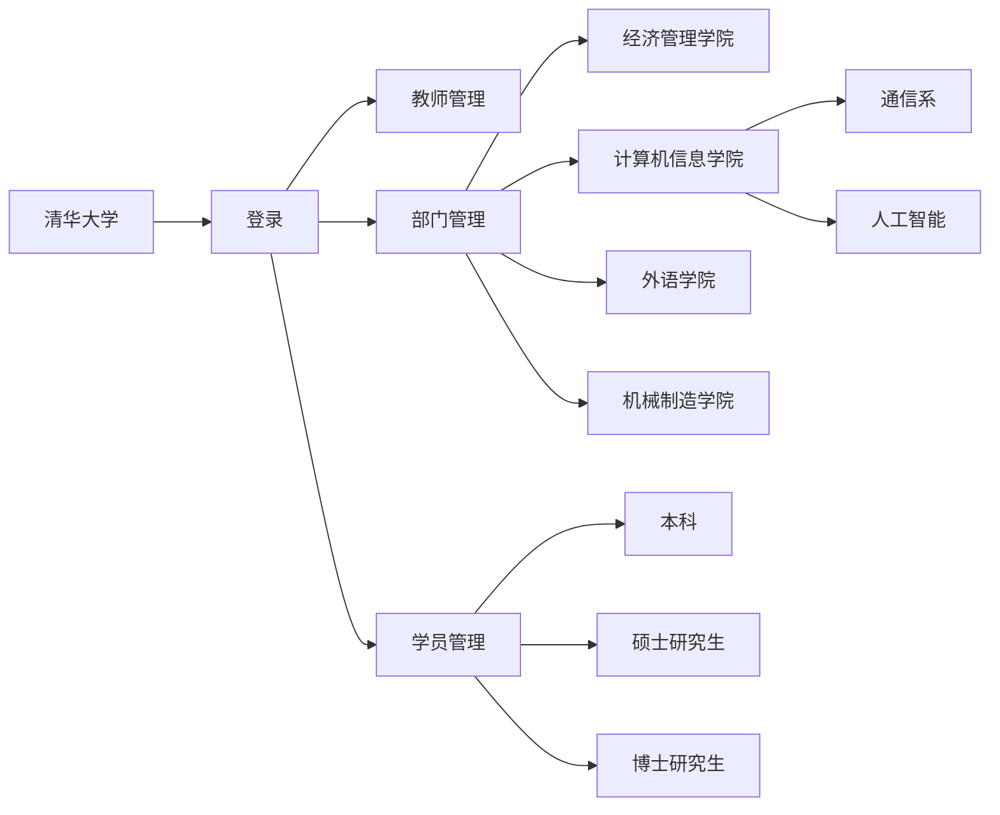


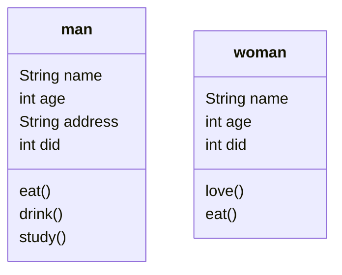

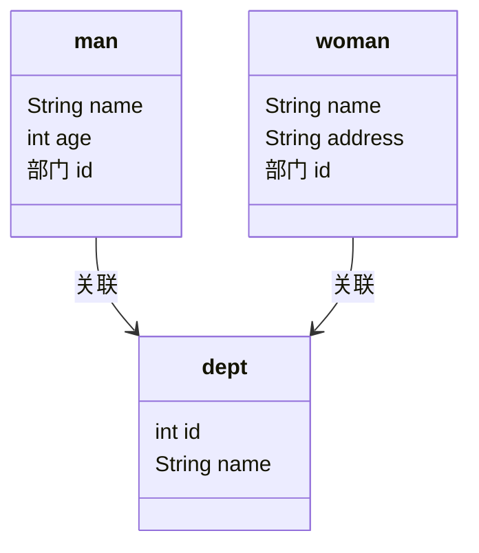


